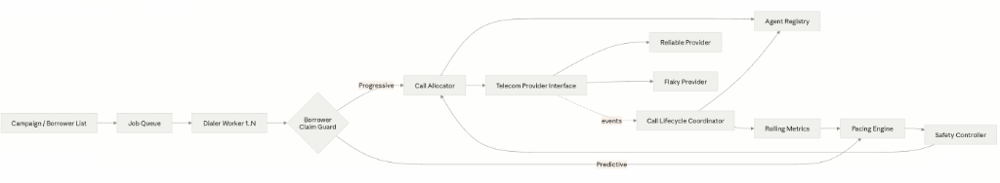
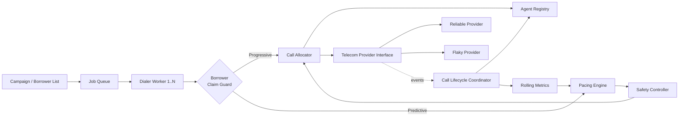
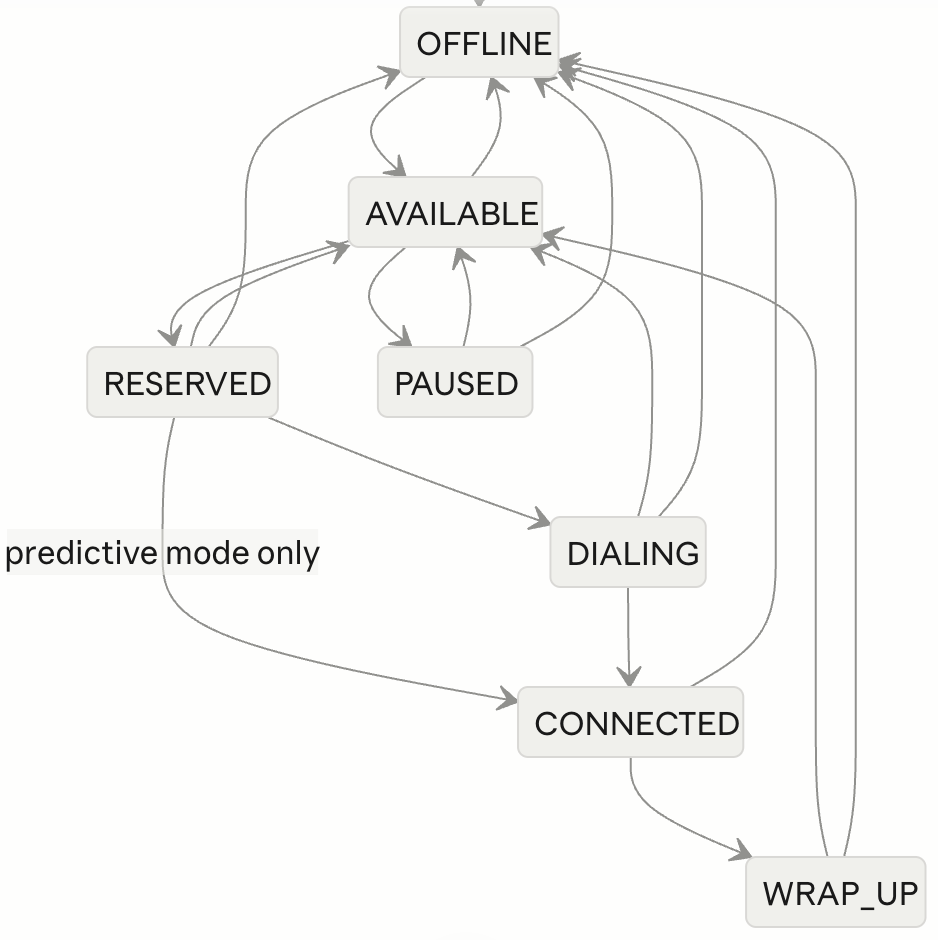
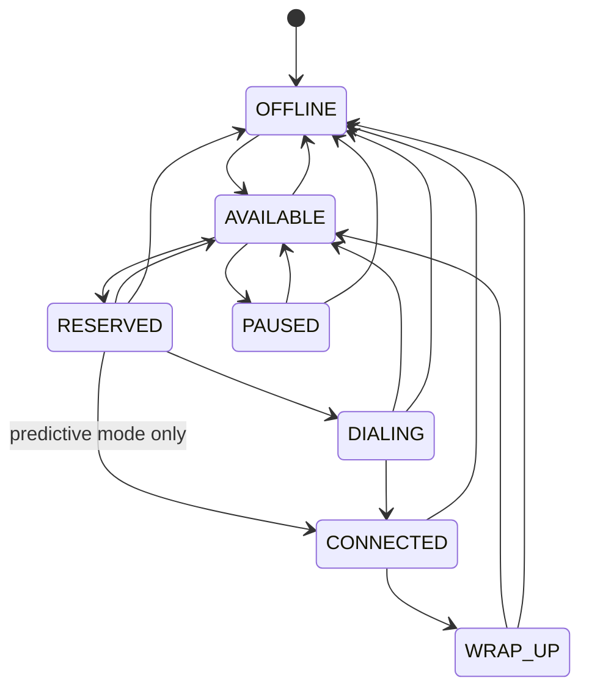
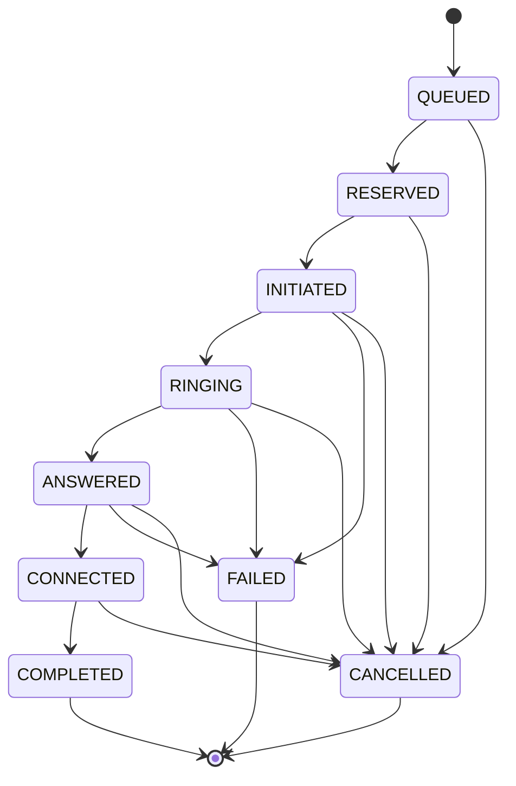

# Architecture

SmartDialer operates as an in-memory, event-driven pipeline designed for progressive and predictive telecom dialing: `Campaign -> Pacing Engine (Progressive/Predictive) -> Safety Controller -> Call Allocator -> Telecom Provider`. In this architecture, the `Safety Controller` acts as a non-bypassable enforcement boundary: the `Predictive Pacing Engine` has zero compile-time dependencies on the allocation, provider, worker, or dialer packages, and produces purely advisory capacity recommendations. The `Safety Controller` independently recalculates hard limits from live system snapshots (agent availability, ringing headroom, and sustained provider degradation) before any call is permitted to dispatch.

## Agent State Machine

The agent lifecycle is managed via lock-free atomic compare-and-set operations governed by an explicit immutable transition table. In progressive mode, an agent is reserved and transitions to `DIALING` before the telecom call is initiated. In predictive mode, deferred binding is used: an agent transitions directly from `RESERVED` to `CONNECTED` when an in-flight call is answered by the borrower.

## Call State Machine

Calls progress through explicit operational states driven by asynchronous telecom provider callbacks. Terminal states (`COMPLETED`, `FAILED`, `CANCELLED`) have empty allowed-transition sets, ensuring natural idempotency against duplicate or out-of-order webhook delivery.

